# Dynamic Web Development 
## Assignment 3
***
## About
***
This repository contains my third assignment for the Dynamic Web Development Class at ITP. The assignment contains a website that displays facts about the Rick and Morty animated series using the  [Rick and Morty API](https://rickandmortyapi.com/). This project consists of a website made with CSS, HTML, and JS using the fetch API/ GET method to access data from an online API and display it interactively on a webpage. 

## Setup
***

 - To open the webpage you can download the files included in the repository and open the **index.html** file with your preferred web browser.

### Prerequisites

 -  An internet browser.
 -  An internet connection.

### Installation

For this particular project, there are no specific installation requirements.

### Develop

To develop this document, you can follow the steps provided below:
1. Create a fork of this project on Github.
2. Ping the author of this repo via Github Issues to see if they are looking for contributions with the specific feature you're looking to add.
3. Open the file in VS Code and make updates .
4. Add and commit those changes in your forked Github repo.
5. Make a pull request specifying what additions and changes were made.
6. Have a nice chat and open communication with me about those changes. 
7. Celebrate the contribution! 

## Built with
***
* [VS Code](https://code.visualstudio.com/)
* [Github](https://github.com)

***
## Author

* [Alvaro Lacouture](https://alvarolacouture.com) 

***
## Acknowledgements

* [Joey Lee](https://jk-lee.com) -- adjunct professor -- [NYU ITP](https://itp.nyu.edu)
* [Cassie Tarakajian](https://cassietarakajian.com/) -- adjunct professor -- [NYU ITP](https://itp.nyu.edu)
* [The Good Project Readme Project](https://github.com/itp-dwd/2020-spring/blob/master/templates/readme-template.md)
* Reddit user [u/Stoned2deth](https://www.reddit.com/user/Stoned2deth/) for his Rick and Morty 8bit characters. Originally found in this [Reddit post.](https://www.reddit.com/r/rickandmorty/comments/62yiew/8_bit_rick_and_morty_characters_i_worked_on/)

***
# Notes & Process

My process began with deciding which API to use, and I believe I went through 8 different APIs before deciding to use the Rick & Morty API. The series is fantastic and I love it, and if you haven't checked it out I encourage you to do so. In any case, after settling on the API I retrieved the data I needed and setup the base for the content that would be displayed in the webpage.

## Process & Documentation

I started by making a simple blank webpage with two elements, a title and a button. I reasoned I should probably think about the design after I saw through the data. In any case, it's always better to look through the API's documentation firsthand! Luckily, the [Rick and Morty API documentation](https://rickandmortyapi.com/documentation) is well documented. So I made the title to display some information about what I was working with and the button so I could control my request with one event and have a way to observe what was going on when I sent it. 

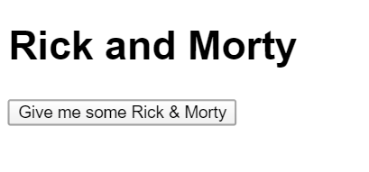

Next was setting up the request. I used 
a promise using fetch() to get a request from `https://rickandmortyapi.com/api/character/?page=1`. After reading through the documentation I figured probably there would be a good place to test my request. I first tried opening the page with my browser so I would know what to expect. You can see it yourself [here](https://rickandmortyapi.com/api/character/?page=1) or check out the image below to get an idea. 

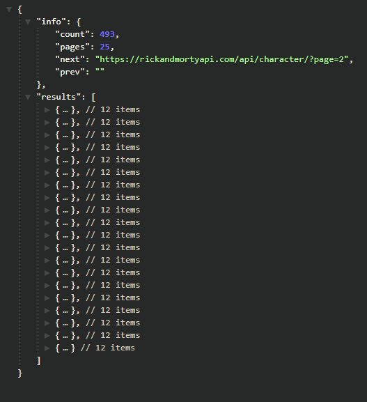

With an idea of what to expect, I console logged my JS request to see what data was being thrown back at me every time I clicked the button... And SUCCESS! You can see the result I had below using the Google Chrome Devtools.

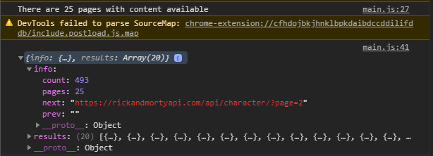

With steady access to the JSON I could play with the data in any way I wanted. Beautiful. Now that I was in the characters' endpoint, why not grab each character individually? After looking closer into the JSON I knew I had 25 juicy pages of information with 493 different characters. On the JSON side, the 'results' array contained every character, as you can see detailed better below. Each character has their ID number, name, status, species, type, and images. Deciding what to start with was easy, the name has more significance for me so I wanted to grab those first.

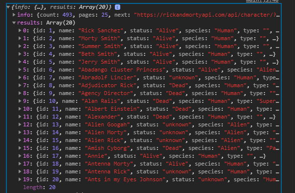
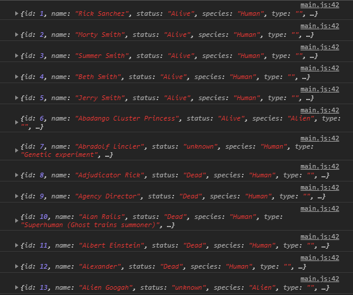

I wanted to test if it was possible to display all different pages, so I decided to take the name parameter from every character available and made it a paragraph element.

    //Button to retrieve every character
    button.onclick = async () => {
    //Loop through every available page and grab every result
    for (var pageNum = 1; pageNum < contentPgs; pageNum++) {
      fetch('https://rickandmortyapi.com/api/character/?page=' + pageNum)

        //Fetch page number pagNum and parse as JSON
          .then(response => response.json())
          .then(result => {
            //Grab every result element (R&M character) from the results array
            //console.log(result)
            result.results.forEach(element => {

              //Make a new 
 element with each character's name
              //console.log(element)
              const p = document.createElement("p");
              p.textContent = element.name;
              p.setAttribute("class", "character__name");
              document.body.appendChild(p);
            });    
          })
      }
    }

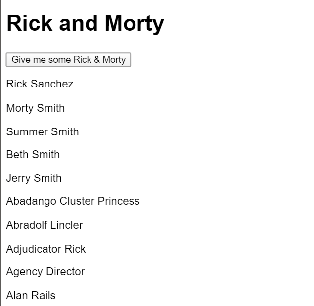

Now that I had the names the next logical step would be to grab the images, of course.

With this information I could start to think about an interface and how each element may appear. 
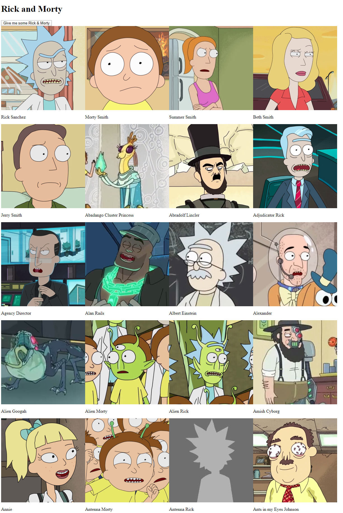
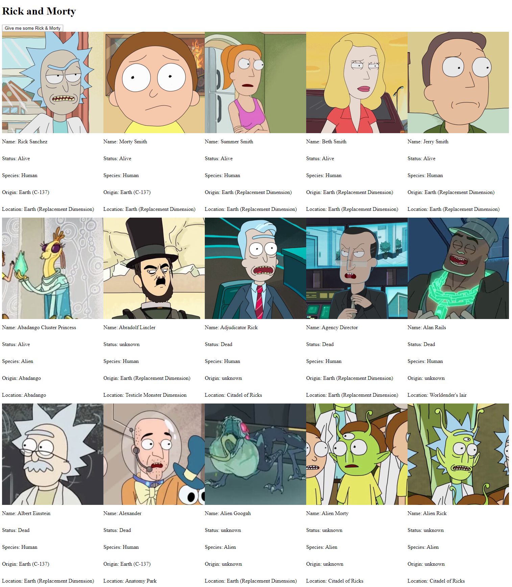

It seemed kind of blunt to have the database with characters appear right away, so I thought about an intro site which would lead into the database. In general I wanted a terminal aesthetic feel, so I went for 8-bit images and lettering. The font is called "Minecraft" and is includded with the repository. To make the intro page I first designed it in Photoshop, and later on replicated it on CSS with minor adjustments. Using flex was essential to the whole process, and made me realize the less parameters and independent positioning you introduce in the styling the better it will work.

SKETCH:
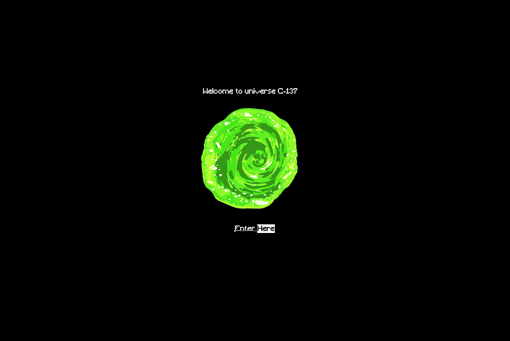

RESULT:
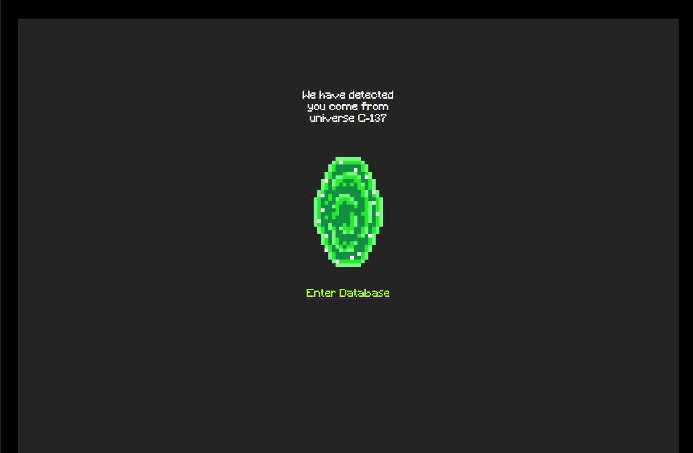
***

I wanted each character to be displayed as a card, with the image to one side and the information to the other. I wanted to give it an old terminal kind of feel, so I went with the Green and Black scheme with white lettering. It also has a crude lettering formatting to amplify the sensation.

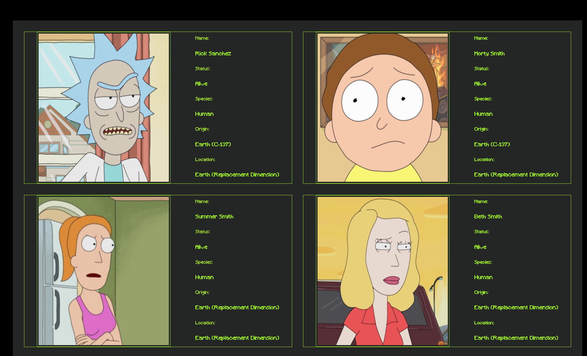

It didn't have much sense to upload every single character right away. So I though about introducing a button which would load more characters when the user decided. Though it took me time to decide where should I introduce the button, I decided to just have an image which would cycle through every available page of information given by the API. Thankfully, I had already recovered that number previously when I displayed all of the characters' names.

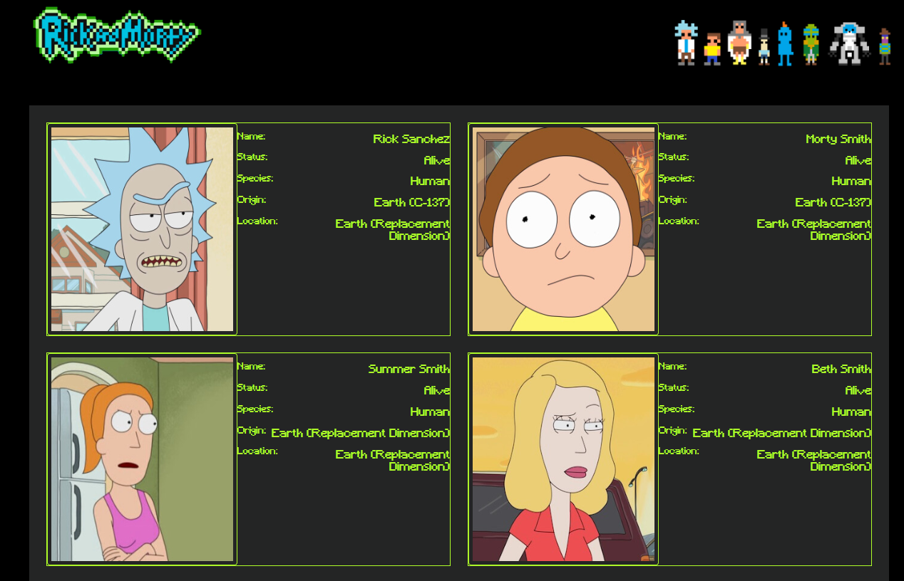

Finally, I played around with the whole styling, padding and margins. And even though I am not completely satisfied with the letter/ positioning configuration, I am content to know it is a matter of decision and not lack of experimentation.

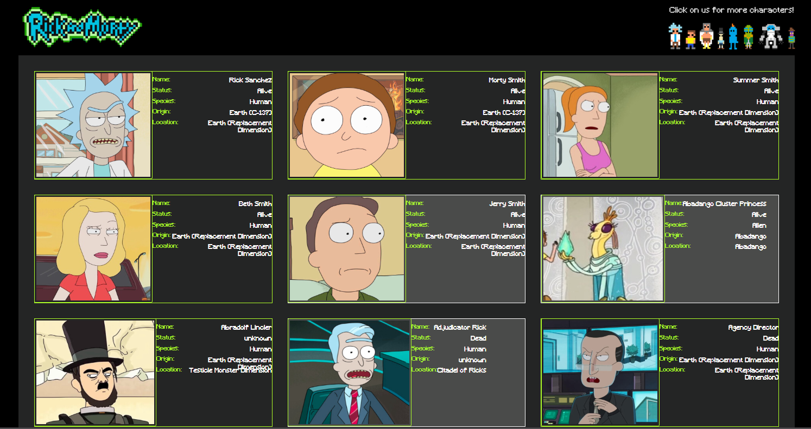

At last implemented some interactions with JS, shown below. They mainly are content changers for the site, loading and removing content according to the user's input.The first one is an intro image which takes you to the main database. Inside, you have two options. If you click on the Rick and Morty logo you will go back to the launch site. If you click on the characters on the top you will see more charactersbeing pulled from the API.

Final look!

***

## Challenges & Struggles

- After creating the content, how to keep track of individual interactions with containers that have the same class name and were created at the same time. For example, when I loaded all of the characters from the API, how could I detect I had my mouse over one of them and change something according to that individual interaction?
- I sometimes worked on a 1920x1080 res screen and sometimes in a 4k screen. The change between letter size and content display was massively different until I introduced media queries.
- Some weird behaviours I could not solve, for example when I click on the image with all the characters to change page the whole div "jumps" a little. Totally clueless as to why. Maybe I put a flex-grow that I forgot about.
- I would have liked to have more time to create "filters" so that you can see characters according to location, origin, etc...
- When I click on the next set of characters button it repeats the first page again. Probably too tired to see where is the mistake though. Will go back to it!

## Questions
- Mostly doubts in terms of how to modify content even further within CSS with JS. Add video filters? Access browser cam?
- How to access databases with authentication tokens? I tried several different databases before settling on the Rick and Morty one, and even though I could access them through terminal's HTTP requests it was not possible through JS.

## References
 -  [The Rick & Morty official website.](https://www.rickandmorty.com/)
 -  [The Rick & Morty 24/7 Marathon stream](https://www.adultswim.com/streams/rick-and-morty) which kept me going.

